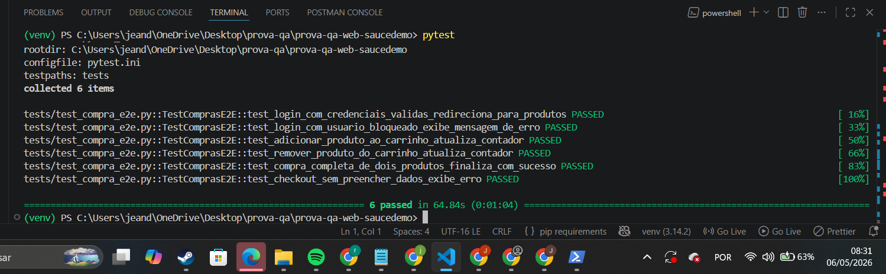
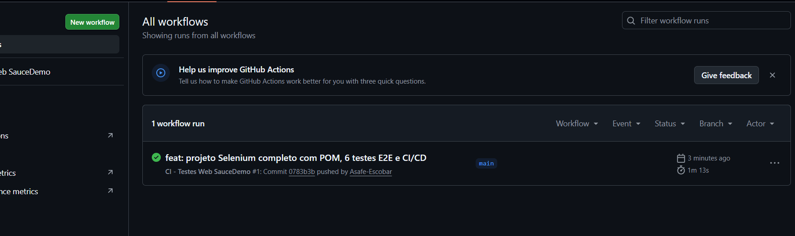

# Automação de Testes Web E2E - SauceDemo

[](https://github.com/Asafe-Escobar/prova-qa-web-saucedemo/actions/workflows/ci.yml)

Projeto de automação de testes Web End-to-End para o site [SauceDemo](https://www.saucedemo.com/), desenvolvido como parte da avaliação da disciplina de Qualidade de Software.

A suíte cobre o fluxo completo de compra (login, adição de produtos ao carrinho, checkout e confirmação), aplicando o padrão Page Object Model e rodando automaticamente em uma pipeline de Integração Contínua via GitHub Actions com Chrome em modo headless.

## Tecnologias

- Python 3.12+
- Selenium WebDriver — automação do navegador
- pytest — framework de testes
- webdriver-manager — gerenciamento automático do ChromeDriver
- GitHub Actions — pipeline CI/CD com Chrome headless

## Estrutura do Projeto

Boa! 🚀 Agora bora finalizar tudo. Vamos por etapas.

ETAPA 1 — Atualizar o README
Abre o README.md no VS Code. Apaga TUDO (Ctrl+A → Delete) e cola o conteúdo abaixo:
markdown# Automação de Testes Web E2E - SauceDemo

[](https://github.com/Asafe-Escobar/prova-qa-web-saucedemo/actions/workflows/ci.yml)

Projeto de automação de testes Web End-to-End para o site [SauceDemo](https://www.saucedemo.com/), desenvolvido como parte da avaliação da disciplina de Qualidade de Software.

A suíte cobre o fluxo completo de compra (login, adição de produtos ao carrinho, checkout e confirmação), aplicando o padrão Page Object Model e rodando automaticamente em uma pipeline de Integração Contínua via GitHub Actions com Chrome em modo headless.

## Tecnologias

- Python 3.12+
- Selenium WebDriver — automação do navegador
- pytest — framework de testes
- webdriver-manager — gerenciamento automático do ChromeDriver
- GitHub Actions — pipeline CI/CD com Chrome headless

## Estrutura do Projeto
prova-qa-web-saucedemo/
├── .github/workflows/
│   └── ci.yml
├── pages/
│   ├── base_page.py
│   ├── login_page.py
│   ├── inventory_page.py
│   ├── cart_page.py
│   ├── checkout_page.py
│   └── confirmation_page.py
├── tests/
│   └── test_compra_e2e.py
├── utils/
│   └── driver_factory.py
├── conftest.py
├── pytest.ini
└── requirements.txt

## Pré-requisitos

- Python 3.10 ou superior
- Google Chrome instalado
- Git

## Instalação

Clone o repositório:

```bash
git clone https://github.com/Asafe-Escobar/prova-qa-web-saucedemo.git
cd prova-qa-web-saucedemo
```

Crie e ative um ambiente virtual:

```bash
python -m venv venv
.\venv\Scripts\Activate.ps1
```

Instale as dependências:

```bash
python -m pip install -r requirements.txt
```

## Execução dos Testes

Rodar a suíte completa (com navegador visível):

```bash
pytest
```

Rodar em modo headless (sem abrir o navegador):

```bash
$env:HEADLESS="true"; pytest
```

Rodar um teste específico:

```bash
pytest tests/test_compra_e2e.py::TestComprasE2E::test_compra_completa_de_dois_produtos_finaliza_com_sucesso
```

## Cobertura de Testes

- Login com credenciais válidas
- Login com usuário bloqueado (cenário negativo)
- Adição de produto ao carrinho
- Remoção de produto do carrinho
- Compra E2E completa (login → carrinho → checkout → confirmação)
- Checkout sem preencher dados (cenário negativo)

## Boas Práticas Aplicadas

- Page Object Model (POM) — cada página do site é uma classe com seus próprios locators e ações
- Herança via BasePage — métodos comuns (clicar, digitar, esperar) centralizados
- Encapsulamento de locators — locators são constantes da classe, escondidos dos testes
- Method chaining — métodos retornam self permitindo encadeamento de ações
- Fixtures do pytest — driver é injetado em cada teste via conftest.py
- Configuração baseada em ambiente — variável HEADLESS controla modo visual vs invisível
- Estratégia anti-flakiness — espera explícita, scroll automático e fallback de JavaScript click
- Limpeza de estado — cookies e localStorage limpos antes de cada login pra evitar cache pollution
- Desabilitação de interferências do navegador — gerenciador de senhas, autofill e popups bloqueados
- AAA Pattern — todos os testes seguem Arrange-Act-Assert

## Pipeline CI/CD

A pipeline configurada em `.github/workflows/ci.yml` é executada automaticamente em:
- push na branch main
- Pull Requests para a main
- Manualmente via aba Actions do GitHub

Etapas executadas em uma máquina Ubuntu:
1. Checkout do código
2. Configuração do Python 3.12
3. Instalação do Google Chrome
4. Instalação das dependências
5. Execução da suíte de testes em modo headless (HEADLESS=true)

## Evidências de Execução

### Testes executados localmente


### Pipeline CI/CD no GitHub Actions


## Autor

Projeto desenvolvido por **Asafe Escobar** para a disciplina de Qualidade de Software.